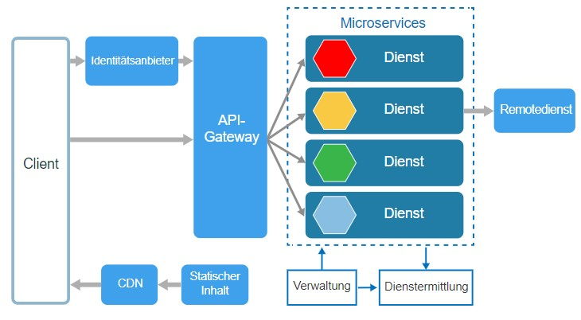

# LB3_M300
## Inhaltsverzeichnis
- [LB3_M300](#LB3M300)
  - [Inhaltsverzeichnis](#Inhaltsverzeichnis)
  - [Container](#Container)
  - [Docker](#Docker)
  - [Microservices](#Microservices)
  - [Sicherheitsaspekte](#Sicherheitsaspekte)
  - [Anleitung für den Betrieb](#Anleitung-f%C3%BCr-den-Betrieb)
    - [1. Installation](#1-Installation)
    - [2. Zugriff auf MySQL Webinterface](#2-Zugriff-auf-MySQL-Webinterface)
    - [3. PHPMyAdmin Login](#3-PHPMyAdmin-Login)
    - [4. Los arbeiten mit PHPMyAmdin](#4-Los-arbeiten-mit-PHPMyAmdin)
    - [5. Zugriff auf Wordpress](#5-Zugriff-auf-Wordpress)
  - [Reflexion](#Reflexion)
  
## Container
Ein Container ist eine Standard-Softwareeinheit, die Code und alle Abhängigkeiten zusammenfasst, sodass die Anwendung schnell und zuverlässig von einer Computerumgebung zur anderen ausgeführt werden kann. Ein Docker-Container-Image ist ein kompaktes, eigenständiges, ausführbares Softwarepaket, das alles enthält, was zum Ausführen einer Anwendung erforderlich ist: Code, Laufzeit, Systemtools, Systembibliotheken und Einstellungen.

## Docker
Docker handelt es sich um eine Open-Source-Software, mit der sich Anwendungen ähnlich wie bei einer Betriebssystemvirtualisierung in Containern isolieren lassen.

Docker-Container, die mit Docker Engine ausgeführt werden:
- **Standard**: Docker hat den Industriestandard für Container geschaffen, damit diese überall hin transportiert werden können
- **Lightweight**: Container nutzen den Betriebssystemkern des Computers gemeinsam und erfordern daher kein Betriebssystem pro Anwendung, wodurch die Servereffizienz gesteigert und die Server- und Lizenzkosten gesenkt werden
- **Secure**: Applikation sind sicherer in Containers und Docker stellt die stärksten Standardisolationsfunktionen in der Branche dar. 

## Microservices

Unter Microservices versteht man Dienste, die jeweils eine kleine Aufgabe erfüllen. Die Prozesse lassen sich wie Module so miteinander verbinden, dass sich daraus eine beliebig komplexe Software ergibt. 

Microservices ermöglichen es, komplexe Anwendungen mit Hilfe einer Architektur bestehend aus vielen kleinen voneinander entkoppelten Diensten und Prozessen zu realisieren. Die Microservices kommunizieren über Schnittstellen und stellen der Applikation jeweils einzelne Funktionen und Dienste zur Verfügung. Selbst komplexe Anwendungssoftware kann auf Basis von Microservices modular entwickelt und umgesetzt werden.

## Sicherheitsaspekte

## Anleitung für den Betrieb
### 1. Installation
Wie oben beim Code erklärt wird per Befehel das Docker-Compose.yml ausgeführt und somit die Container aufgesetzt:

'''docker-compose -f ʺPfad\zum\File\docker-compose.ymlʺ up -d --build'''

### 2. Zugriff auf MySQL Webinterface
- Um auf PHPMyAdmin zuzugreifen, muss ein Browser geöffnet werden.
- Es wird die URL http://localhost:8080 eigegeben

### 3. PHPMyAdmin Login
Als Benutzer wird User genommen

Das Passwort ist 1234

Die Anmeldung erflogt beim drücken der Enter-taste

### 4. Los arbeiten mit PHPMyAmdin
AB jetzt kann mit PHPMyAdmin gearbeitet werden. Es können Datenbanken erstellt und administriert werden.
Wenn benötigt können neue Benutzer im Phpmyadmin angelegt werden.

### 5. Zugriff auf Wordpress
- Um auf Wordpress zuzugreifen, muss ein Browser geöffnet werden.
- Es wird die URL http://localhost:8081 eigegeben
- 
Jetzt kann die Sprache ausgewählt werden. Anschliessend wird die erste Seite erstellt.

## Reflexion
